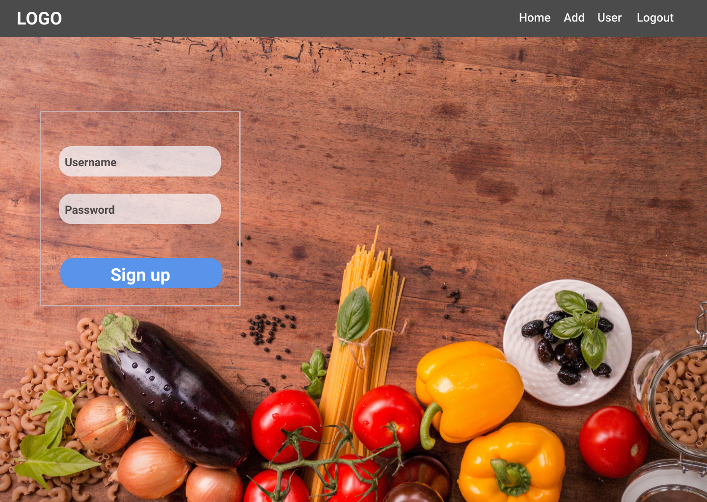
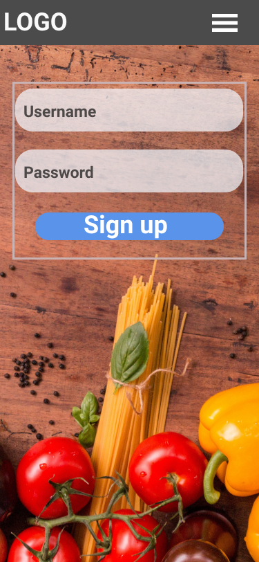
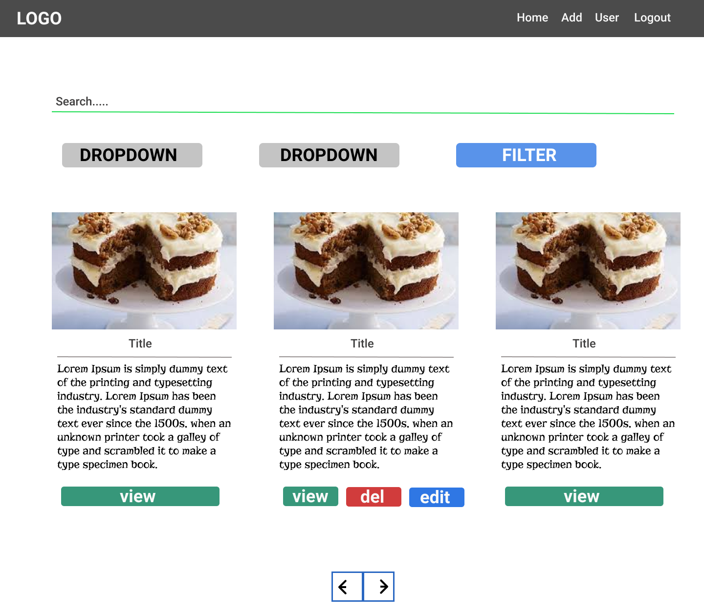
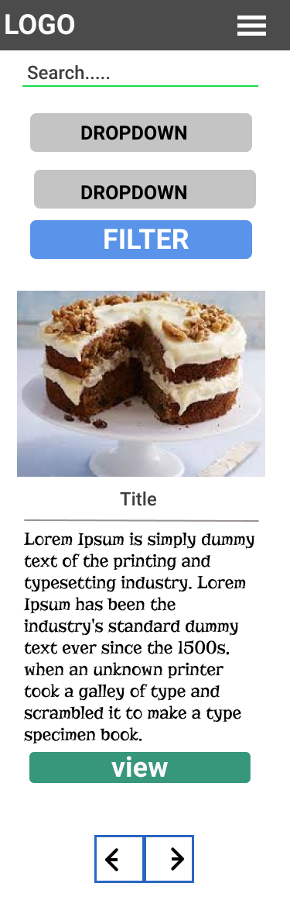

# The CookBook 
*by conor o shea*

A socailly Recipe website for users to put up there own recipes in which others can like the recipe and share comments with one another 

## UX

*User Stories:*
As a user of the recipe cookbook I should be able to do the following things:
* Look through all of the current recipes on the site in a simple way
* Search the recipes by keywords and other filters such as cusine,skill etc....
* Ability to sign up and login with with own username and password
* Add recipes to the site when I have logged in or sign up  
* Have full CRUD functionality when I am logged in. So it is possible to update, delete and edit a users own recipe
* Get a more detailed view of each recipe where I can see ingredients and how to make it.
* Like recipes

## UI
For this project I concentrated more on implentmenting features and logic and less so on the frontend which is why there is not much custom css and styling. I tried to use as much bootstrap as possible but I still needed to write some of my own css to achive the look I intened.The wireframes below were used to give be a rough idea of how wanted the pages to look but I also adjusted the styling as I was building the project to make it more suitable .

#### WireFrames

|                Desktop                 |                Phone                 |
| :------------------------------------: | :---------------------------------: |
|  |  |
|  |  |

## Current Features
*Register and  Login*
* A user can sign up and create a new account. 
* The password of the user is hased before its stored in the database
* Username and password are checked to make sure its the corect user
* Once the user is logged in there nav will change giving them access to extra features

*Recipes*
* A user can look through all the current recipes in the data base

*Single Recipe*
* Where a user can view a more detailed view of the recipe.
* Info such as ingredients and instruction can be viewed here.

*User Recipes*
* A page which allows logged in users to qucikly see only there current recipes in the database

*Pagination*
* Pagination is included on the recipes pages when the number of results to display is over 6. This is to reduce loading times.

*Like Button*
* Once a user is logged in they have the ability to like a recipe
* the number of liked is displayed in the recipe page based on how many users have liked the recipe

*Comment Section*
* A logged in user can make a comment on each recipe page

*Filter Recipes*
* Can filter recipes down by categories

*Word Search*
* Allows user to seaarch for a word to comes up in the title,tags or ingredients

*Add and Edit Recipes*
* A form input which allows the user to add a recipe to the database.
* HTML form validation used to make sure the required fields cant be empty
* The same form is used to edit and updated the recipe.

*Delete a Recipe*
* The user can delete there own recipes which they have created 

## Feature left to implement 
Due to such a tight time limit there was a lot of feature I had to leave out these are some of which:
* The ability to like a comment
* A user profile page where you could check out that users reipes
* An admin type age which would display charts of what type of recipes have the most like etc....
* A dislike button on each recipe

* More Automated test for the business logic of the application
* Form validation using python instead of html

## Technologies Used

#### Python
* Provides the logic for this site

#### Flask
* Template langauge that provides all the routes and redirects for this projects web pages

#### Jinja
* To implement python code into html files

#### Pymongo
* Pymongo was used for interacting with MongoDB database from Python

#### MongoDB 
* MongoDB was used as the database for this site

#### JavaScript / Jquery
* JavaScript and Jquery where used to add varoius animations on the page. for example when there is no user logged in a popup is diplayed when you press the like button

#### Bootstrap 
* Bootstrap for is grid columns
#### HTML
* HTML was used for the markup and layout of each webpage

#### CSS 
* CSS used to add styling to html and customise the layout

## Testing

Testing was performed in 3 different ways.  
1. Manual Browser Testing during develoment  
2. User testing
3. Automated Testing 

#### Browser Testing and Manual Testing

##### Testing Responsiveness 
During development the site was being checked regulary using google chrome , I made use of chrome developers tools to check the responsiveness of each page to make sure it looked good on all devices and adjusting layout as needed to find a happy medium. 

After I had deployed the site to heroku I could regulary check it on my phone and tablet to see how it looked and feels in real life on its device.

##### Testing Python Logic
During the course of development. After each new feature was implmented. I checked it was doing what it should have been. This was done by checking my mongoDB database to see if I was getting the correct results. Like when I went to add a recipe I expected to see a new recipe in my database

####  User Testing

I had classmates , family and friends check the website on various devices from phones,tablets and desktops no issues were reported back ect...

#### Automated Testing
This is a feature if more time was given I would of very much liked to explore further. Currently I have some very basic automated test that check if the page is loading or not.In the future as I gain more knowledge I intend to expand this much further to fully automate all the business logic such as test for checking if a recipe has been added etc...

## Credits

###  Content and Media

- I used  BBC Recipes to add al the orginal recipes to the database https://www.bbc.co.uk/food/recipes

### Acknowledgements
- Thanks to my mentor spencer for all the advice throughout the project
- Thanks to classmate liam for discussing problems and solving them in some pair programming 

